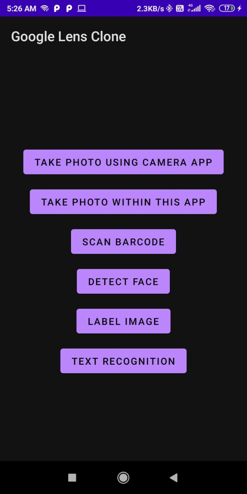
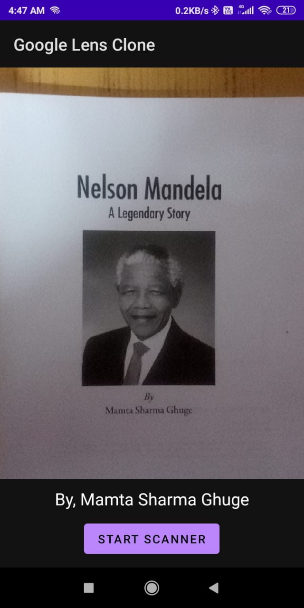
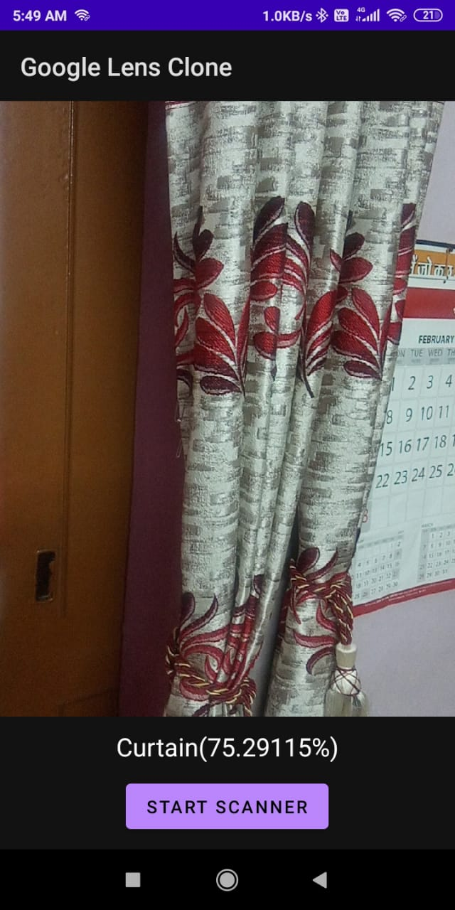
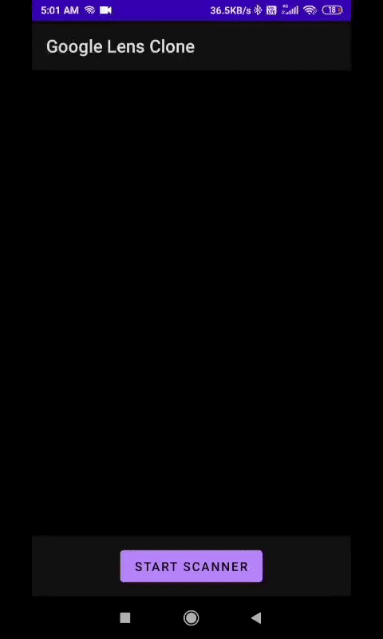

### GoogleLensClone
An Android app that makes use of CameraX and ML Kit for Barcode Scanning, Face Detection, Image Labelling and Text Recognition.

#### _App Screenshots_
|  |  |  |  |
|---|---|---|---|
